# 通用链控工具项目

## 1. 项目介绍
智能合约-链上交互: 
1、多链多节点客户端管理:
基于多租户的概念设计动态链路/节点选择，主要是基于工厂和私有线程实现, 
多节点路由 +  (查询类)加权轮询动态负载均衡 + (交易类)固定链固定节点模式 + RPC健康检查; 
数据流向: 请求头信息 -> 过滤器逻辑 -> 私有线程入参 -> 业务逻辑 -> 客户端相关逻辑 -> 私有线程出参 -> 调用逻辑 -> 过滤器 -> 私有线程清理  
2、链上交互(交易类)-通用转账; 
3、链上交互(查询类)-账户额度查询 
其他: 
通用excle导出模块、集成https自签证书、基于db集成quartz分布式定时器管理模块，前端代码扫描模块， 
底座(集成swagger、链路日志traceId集成到交互层、自定义异常类架构、支持多端口、令牌控制(校验令牌/刷新领导), 
单元测试集成,flyway数据库集成框架、多数据源、配置文件加密、全局校验), 
自定义手写代码生成,二层缓存设计(本地缓冲+redis缓冲+广播所有本地缓冲失效)。

版本: jdk: 1.8 、SpringBoot 2.3.4

## 2. 效果

### 2.1. 自签证书模块

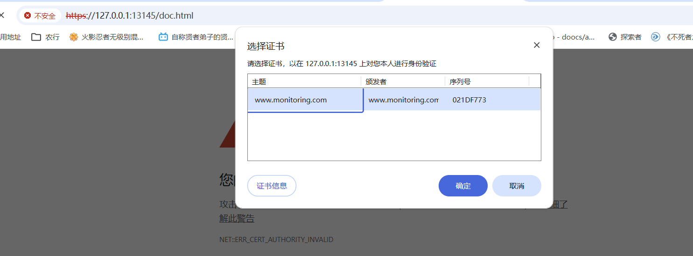

### 2.2. 智能合约相关模块
查询额度:
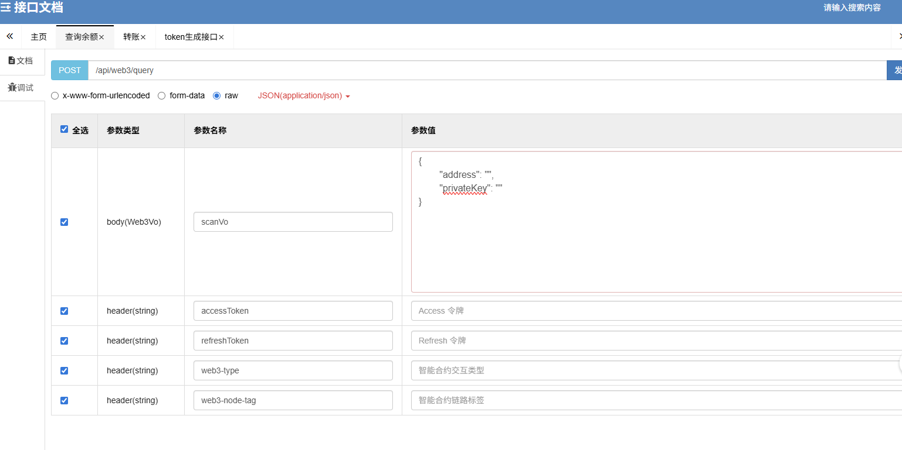
智能合约类型:0，代表查询类 
智能合约链路标签输入链的颗粒度，因为查询类会走加权权重多个RPC地址。
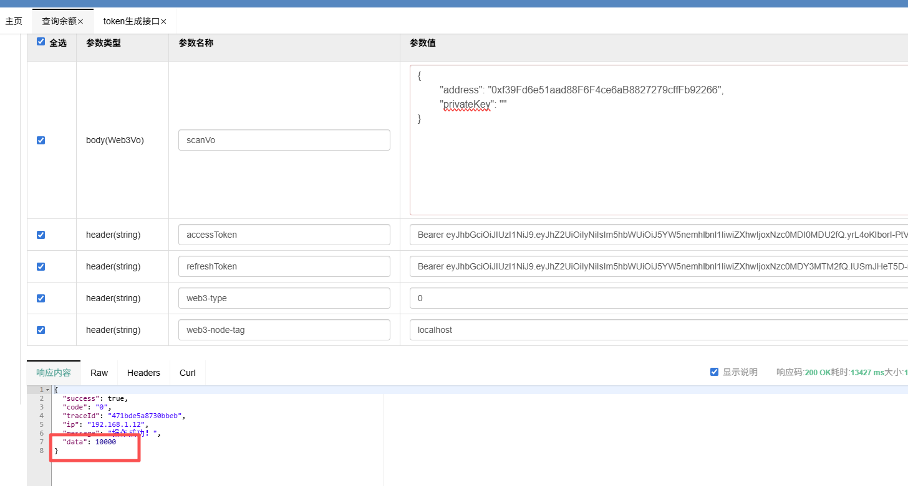

往这个账户0xf39Fd6e51aad88F6F4ce6aB8827279cffFb92266转账 

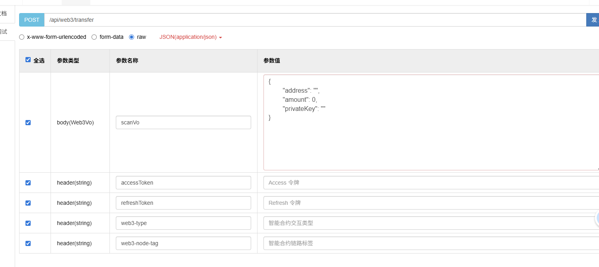
智能合约类型:1，代表交易类 
智能合约链路标签输入节点RPC的颗粒度，因为交易类会走固定链路固定RPC节点的路径，对于交易类因为nonce等因素必须是同个rpc地址。 
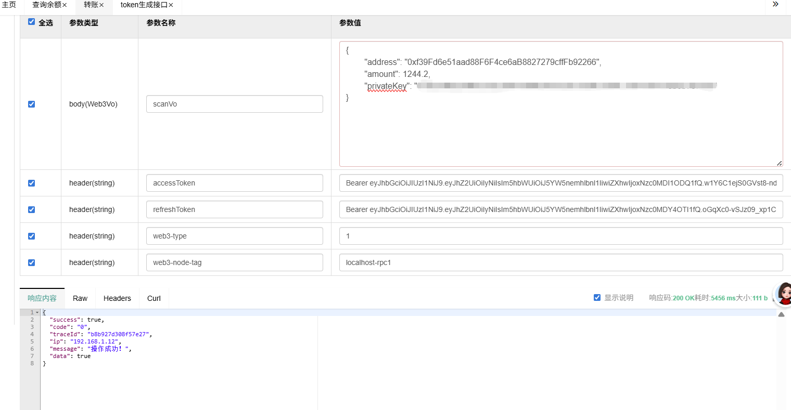
执行成功，查看账户额度。
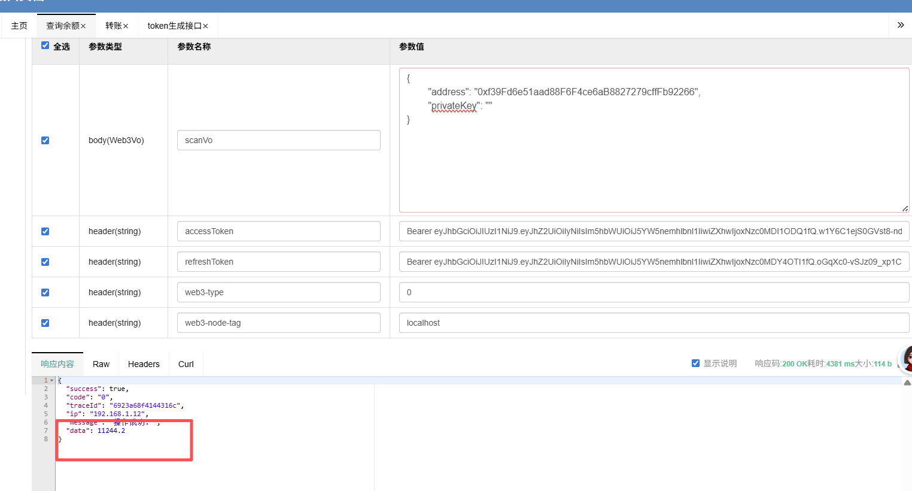

转账成功!!!

### 2.3. token相关模块
如果不传入令牌，会被token拦截:
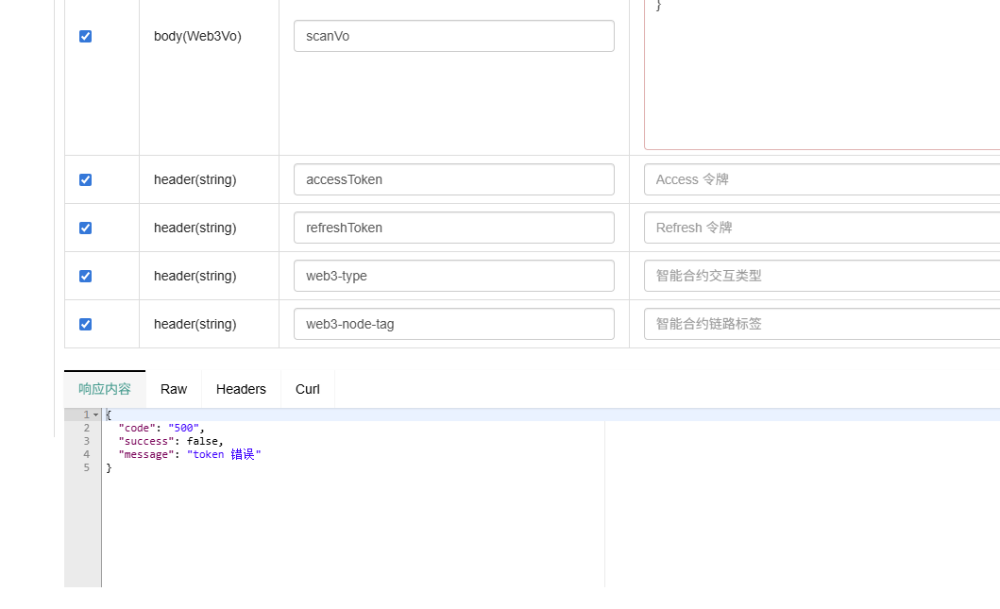
生成token:
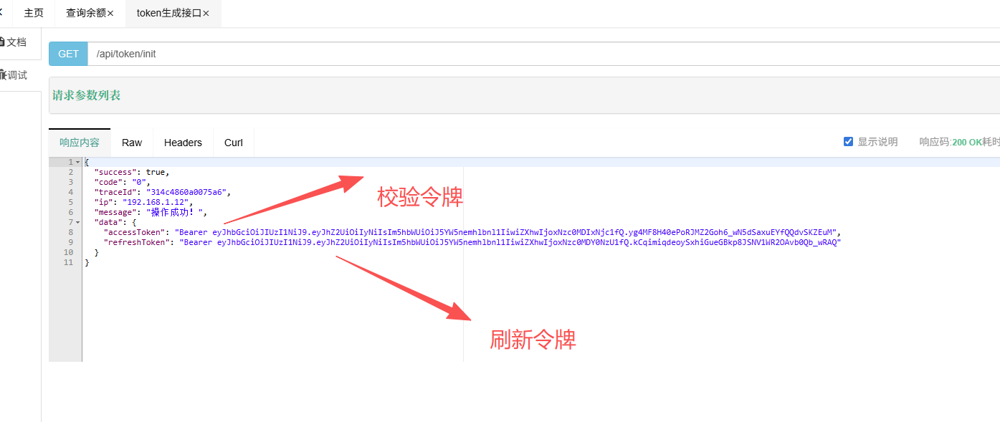
同时 日志traceID、服务ip在返回层统一封装:
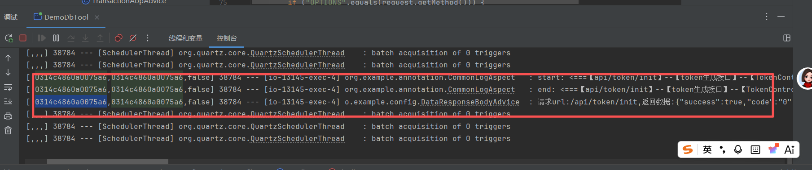

测试其他接口:
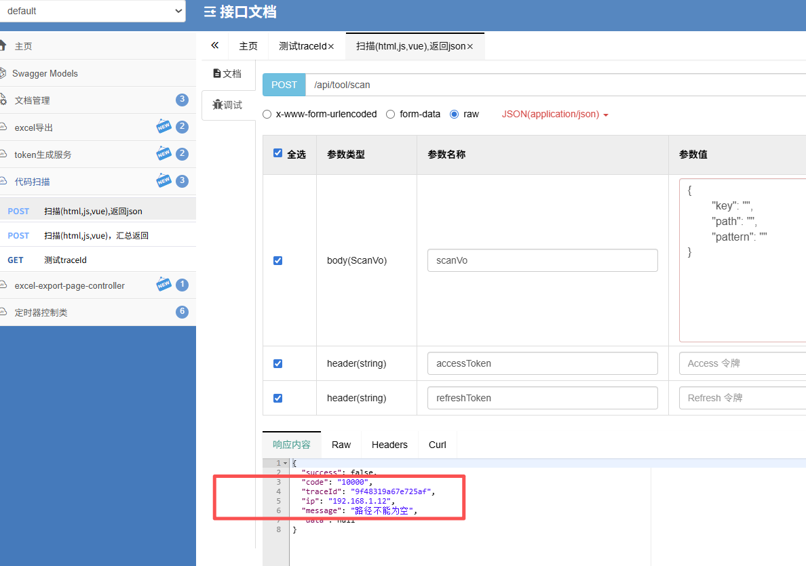
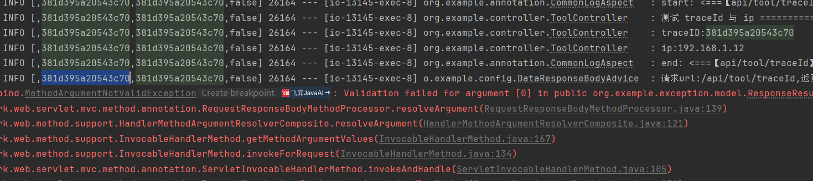

### 2.4. 代码扫描模块

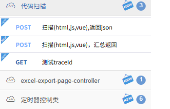

### 2.5. excel通用模块

### 2.6. 分布式定时器管理模块

### 2.7. 自定义手写代码生成
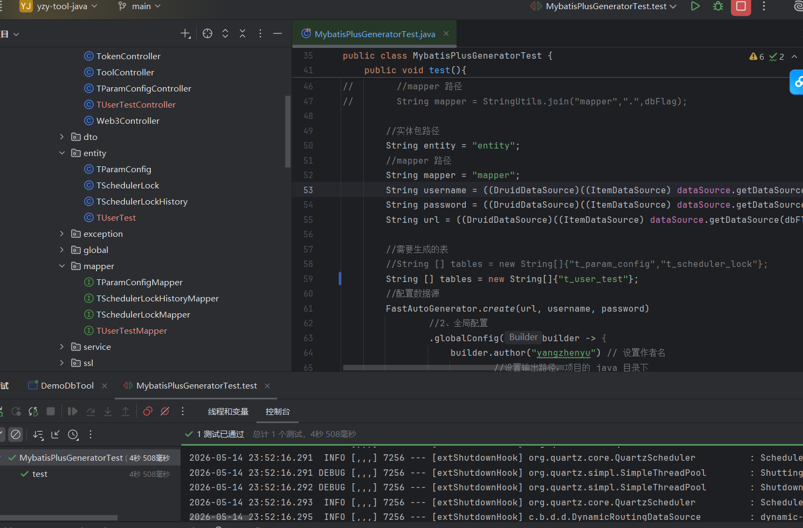